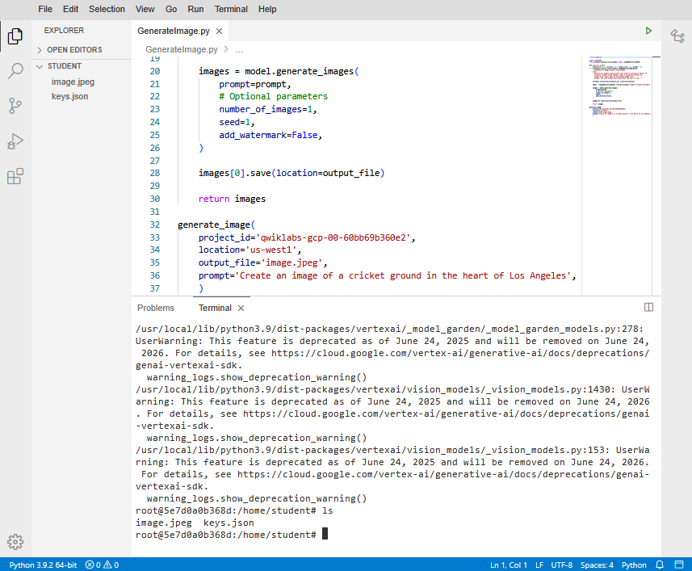
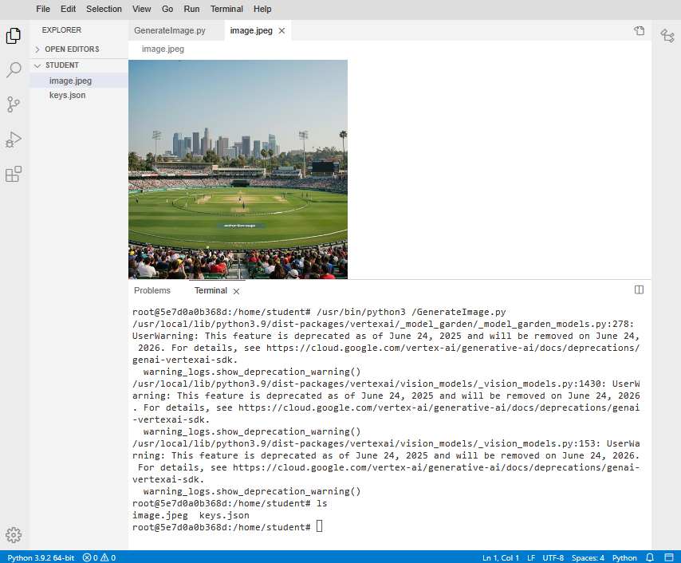
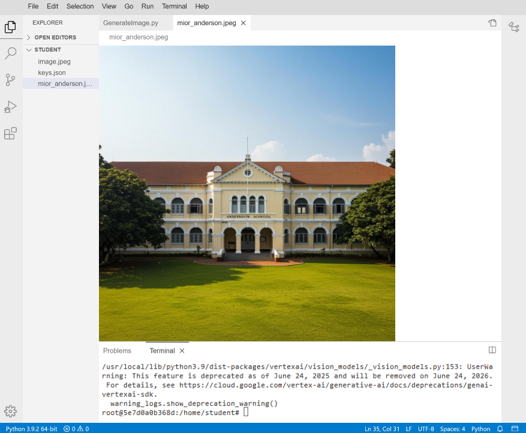
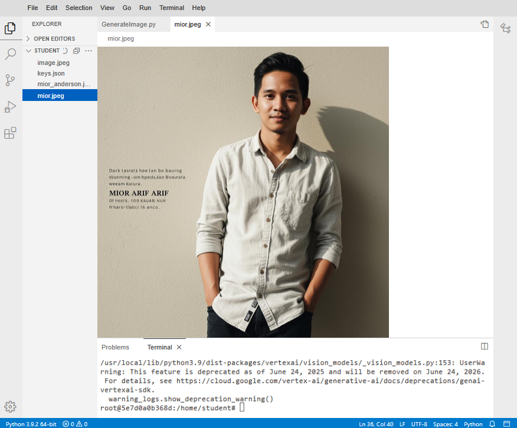
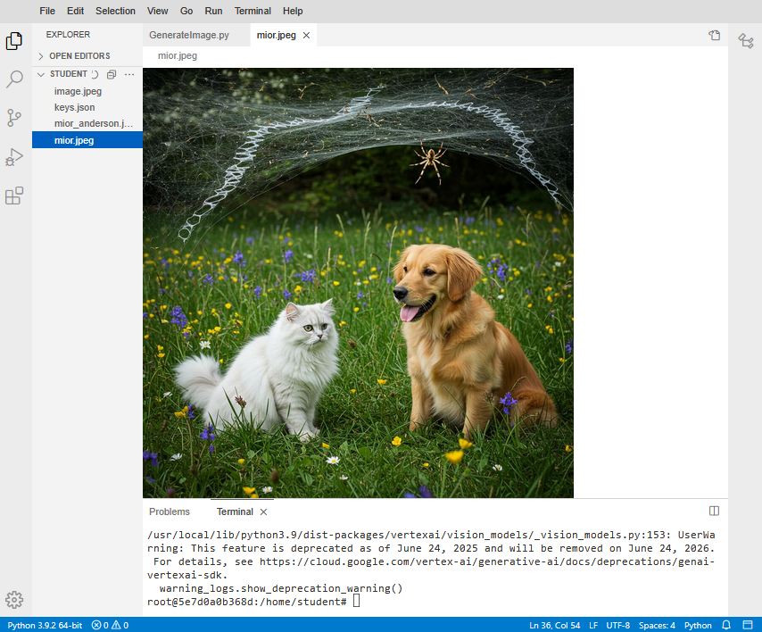

# imagen
imagen : AI Image Model # Text-to-image diffusion model

## Objective
- To generate image using text prompt
- To leverage ImageGenerationModel.from_pretrained("imagen-3.0-generate-002")

## ImageGenerationModel : Imagen 3.0

